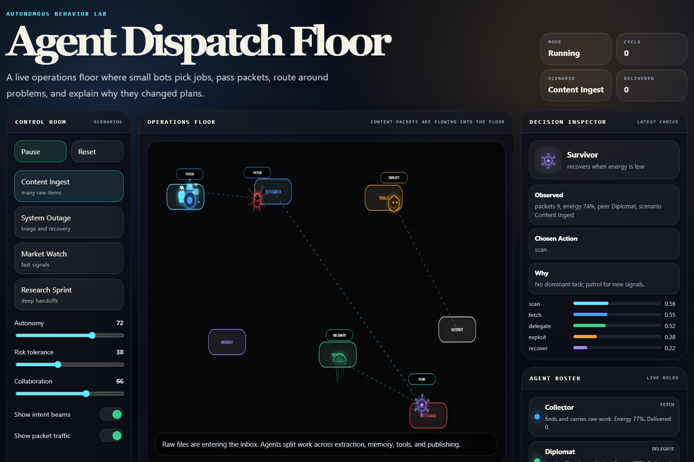

# Agent Playground

<p>
  <a href="https://galvinlam.github.io/agent-playground/" target="_blank" rel="noopener">
    Open Agent Playground
  </a>
</p>

Agent Playground started from a simple question: what makes a bot look like it is thinking?

Instead of building another chat interface, this experiment turns that question into a small visual sandbox. Tiny agents move around a shared board, react to resources and hazards, choose behaviors, and leave behind a readable trail of decisions. The point is not to make the smartest possible agent. The point is to make the decision loop visible.

Each agent has limited energy, a goal, and a simple personality. Sometimes it explores. Sometimes it gathers. Sometimes it follows another agent, trades, competes, recharges, or flees. Small rule changes can make the group feel calm, greedy, cooperative, or chaotic.



## Open It

No install or build step is required.

1. Open `index.html` directly in a browser.
2. Or serve the folder locally:

```powershell
python -m http.server 8000
```

Then visit `http://localhost:8000`.

## What It Demonstrates

- A canvas-based sandbox with simulated agents.
- Agent status cards that show energy, mood, current behavior, and score.
- Behavior choices such as gather, explore, trade, follow, flee, recharge, cooperate, and compete.
- Scenario buttons that change the environment.
- Strategy sliders and toggles that influence how agents decide what to do.
- A visible timeline/log explaining important decisions in plain language.

## Why It Exists

Autonomous agents can sound abstract when they are described only in terms of prompts, tools, and planning loops. This project makes the idea easier to see. An agent observes its surroundings, updates its internal state, chooses an action, and affects the world around it.

The sandbox is intentionally lightweight. It is a place to experiment with behavior, not a full game engine or a serious simulation. The interesting part is watching simple decision rules combine into something that starts to feel alive.
